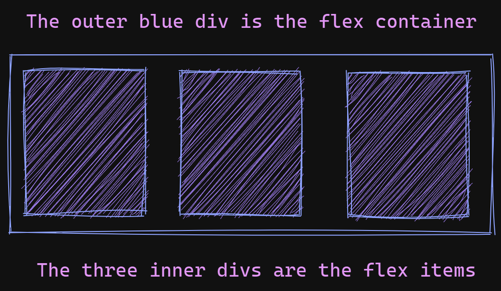
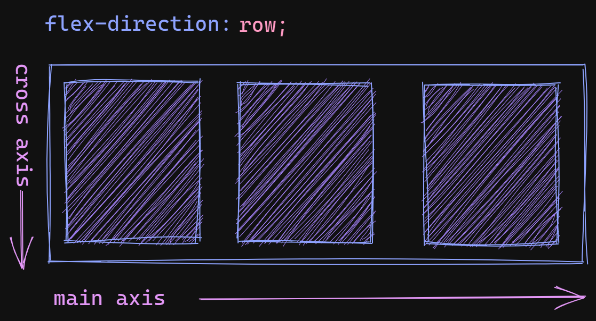
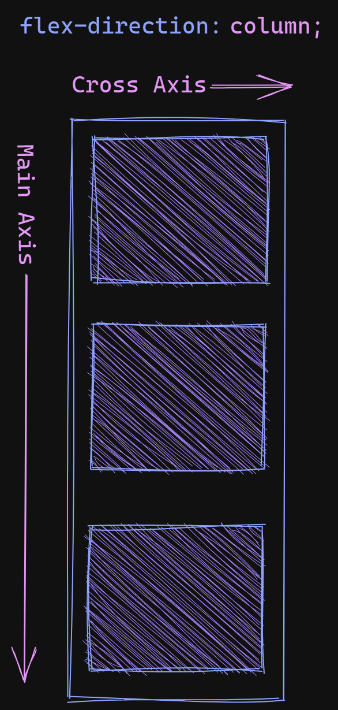

# The Secret To Understanding Flexbox

## Introduction

Learning how to properly use **flexbox** can be difficult. There are many different CSS properties related to flexbox and it seems like there are 32 different ways to do the same thing. When I first
started learning about flexbox I would usually just randomly try different properties until I got
the layout that I was looking for. I didn't fully understand flexbox. It never really clicked
for me until I gained a proper understanding of the different axes (that's axes as in more than one
axis).

## What is the purpose of flexbox?

Flexbox can be used to change how elements are placed on a page. By default, block level elements
will stack and inline elements will be placed inline. Changing the flow of elements and getting
the spacing exactly how you want it can be difficult. Flexbox makes it much easier to do this.

Flexbox allows you to turn an element into a flex container and easily change how the
elements within the container are positioned. If you want to create a responsive navigation bar
with evenly spaced items you can easily do that with flexbox. You can also nest flex containers
to create some pretty complicated layouts.

## Rows and Columns

We will use this simple HTML as the basis for our discussion of flexbox:

```html
<div class="container">
  <div>Item 1</div>
  <div>Item 2</div>
  <div>Item 3</div>
</div>
```

We have a parent div with three child divs. By default these three divs will be stacked on top of
each other inside of the parent div since they are block level elements. There is nothing special
about this HTML, it is just regular old HTML.

We could have used any elements inside of our parent div, we could have used a span or a paragraph, it doesn't matter. A flex item can be an inline element or a block level element.

## Making flex items line up in a row

```css
.container {
  display: flex;
  flex-direction: row; /* this is unecessary because it is the default */
}
```

The CSS above turns our parent div into a **flex container**. It causes the child divs, which are now
**flex items**, to line up in a row and stack side by side. The **flex-direction** property is optional
here because **row** is the default **flex-direction**.

:::info And just for demonstration purposes we will pretend that our child divs actually have some content or size set on them, otherwise they wouldn't actually display at all.
:::

Our divs will now be laid out like in the image below:



## Two Different Axes - Main Axis and Cross Axis

When dealing with flexbox there are two different axes. One axis runs from left to right and the
other runs from top to bottom. One axis is called the **main axis** and the other is called
the **cross axis**. The direction of each axis will change depending on the value of the
**flex-direction** property. **This is the most important thing to remember**. This isn't like
in algebra where the x axis is always horizontal and the y axis is always vertical, sometimes
the **cross axis** is vertical and sometimes the **main axis** is vertical.

These axes determine how flex items line up when added to a flex container.

:::info
It is possible to reverse the axes using **row-reverse** and **column-reverse**, but the concepts
here are still the same.
:::

## Position flex items using the cross axis and the main axis

<!-- :::tip
Main Axis === flex-direction
::: -->

If you have a flex container that has its **flex-direction** set to **row**, items inside
the flex container line up in a row from left to right, or right to left if **flex-direction**
is set to **row-reverse**. This means the **main axis** runs from left to right (or right to left). The
**cross axis** is the opposite axis which runs from top to bottom.

If you have a flex container that is set to **row** and you want to adjust how the flex items
are displayed on the horizontal axis, you would adjust how the items are placed on the **main axis**.
Since the **flex-direction** is set to **row**, our **main axis** is going horizontal. Our **cross axis** is the other axis, which in this case is the vertical axis. If we wanted to adjust how our
items are placed along the vertical axis we adjust how the items are placed along the **cross axis**.

:::info

#### As a general rule:

When **flex-direction** is set to **row**, the **main axis** is **horizontal** and
the **cross axis** is vertical.

When **flex-direction** is set to **column**, the **main axis** is **vertical** and
the **cross axis** is horizontal.
:::


## Lining up flex items in a column

If the **flex container** is set to **column**, items will stack on top of one another in a column.
The **main axis** now runs from top to bottom or bottom to top if **flex-direction** is set to
**column-reverse**.

```css
.container {
  display: flex;
  flex-direction: column; /* changing the flex container to column */
}
```

When you set the **flex-direction** to **column**, the flex items line up in a column and the
axes will flip the. The **main axis** is now the vertical axis and the **cross axis** is now the horizontal axis.

:::info
If you only use **block** level elements inside your flex container which has **flex-direction** set
to **column**, you won't see much benefit since by default block level elements already stack (or start on
a line by themselves). You **will** notice the difference when you want to position your flex
items along the **cross axis**, such as centering items or aligning them to the right or left.
:::



## The two most useful flexbox properties

### justify-content - adjust the main axis

If you want to adjust how items are displayed along the **main axis** you use the CSS property
**justify-content**. This property is applied to the **flex container**, NOT the flex items.

### align-items - adjust the cross axis

To adjust items on the **cross axis** you use the **align-items** property. As mentioned above,
this is applied to the **flex container**, not the flex items.

Some of the most useful values for **justify-content** and **align-items** are:

- center
- space-between
- space-around
- flex-end
- flex-start

## Conclusion

The easiest way to get practice with these settings is to check out this [Codesandbox](https://codesandbox.io/s/flexbox-demo-11g6r7?file=/style.css).

The CSS file, style.css, is very heavily commented. You can try changing the values for each of
the flex containers, .flex-row and .flex-column, and see how the output changes.

There are many other properties that you can edit for flex containers. There are also many ways
to achieve the same results. Once you understand the difference between the two axes you will have
a much easier time using flexbox. Understanding the terminology also makes it much easier to find
answers when you have a question.

## References

There is a lot more to learn about flexbox. Some of the best info comes from MDN. Here are
some links you can check out:

- [Flexbox](https://developer.mozilla.org/en-US/docs/Glossary/Flexbox)
- [Main Axis](https://developer.mozilla.org/en-US/docs/Glossary/Main_Axis)
- [Cross Axis](https://developer.mozilla.org/en-US/docs/Glossary/Cross_Axis)
- [flex-direction](https://developer.mozilla.org/en-US/docs/Web/CSS/flex-direction)
- [justify-content](https://developer.mozilla.org/en-US/docs/Web/CSS/justify-content)
