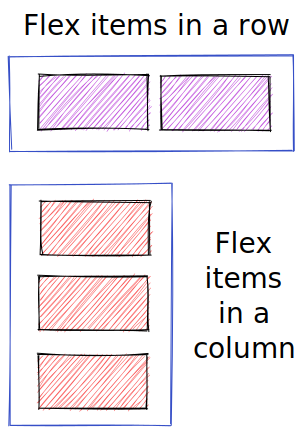
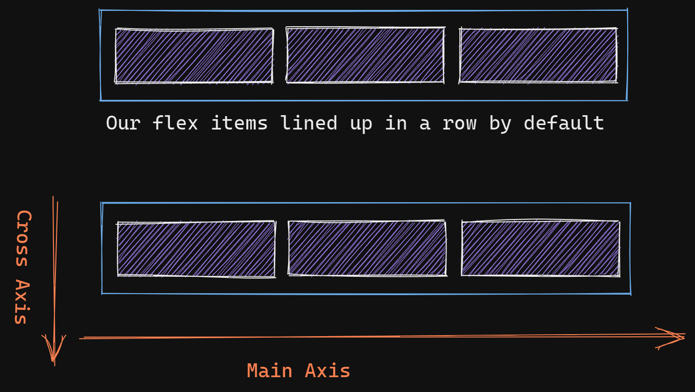

# The Secret To Understanding Flexbox

## Introduction

Learning how to properly use **flexbox** can be difficult. There are many different CSS properties related to flexbox and it seems like there are 32 different ways to do the same thing. When I first
started learning about flexbox I would usually just randomly try different properties until I got
the layout that I was looking for. I didn't fully understand flexbox. It never really clicked
for me until I gained a proper understanding of the different axes (that's axes as in more than one
axis).

## But first, what is the purpose of flexbox?

Flexbox is used to lay out elements in a row (side by side) or in a column (stacked on top of each other).

In the image below the boxes outlined in blue are the **flex containers**, the items inside each **flex
container** are **flex items**.



## Rows and Columns

We will use this simple HTML as the basis for our discussion of flexbox:

```html
<div class="container">
  <div>Item 1</div>
  <div>Item 2</div>
  <div>Item 3</div>
</div>
```

We have an outer div with three inner divs. We could have used any elements inside of our outer div, we
could have used a span or a paragraph, it doesn't matter. A flex item can be an inline element or a
block level element.

**The default behavior of flexbox is to align the items in a row.**

```css
.container {
  display: flex;
  flex-direction: row; /* this is unecessary because it is the default */
}
```

Turning our outer div into a flex container the inner divs, which are now flex
items, are going to end up sitting next to each other in a nice little row:



## Flexbox items flow on the main-axis.

When a flex container's **flex-direction** is **row**, the **main axis** is the x axis,
or the horizontal axis. The **cross axis** is always the opposite axis from whatever the main axis
is.

You can see in the diagram above that when the **main axis** is the horizontal axis, the **cross axis**
is the vertical, or y axis.

## Flipping everything around

```css
.container {
  display: flex;
  flex-direction: column; /* changing the flex container to column */
}
```

When you set the **flex-direction** to **column**, the flex items line up in a column. The
axes will also flip, the **main axis** is now the vertical axis and the **cross axis** is now the horizontal axis.
